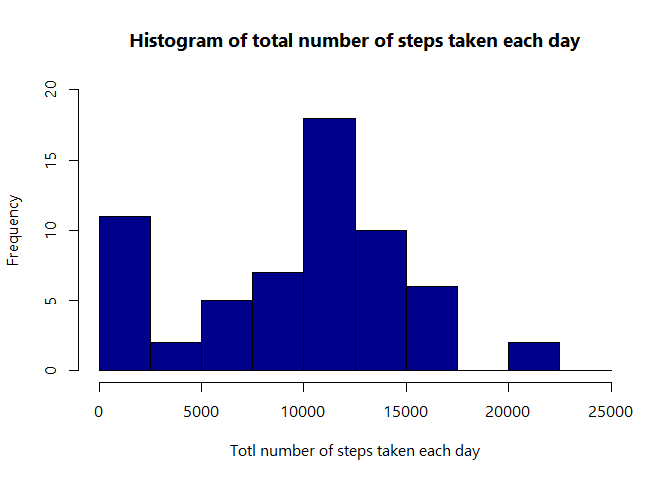
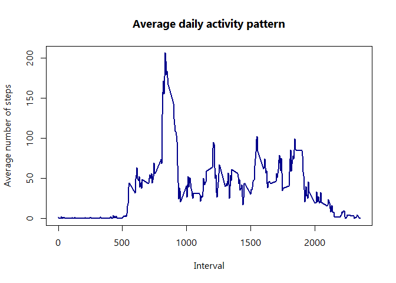
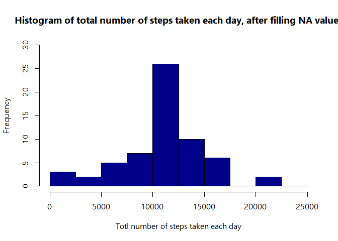
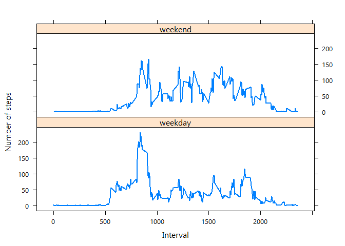

## Loading and preprocessing the data


```r
setwd("C:/Users/user/Desktop/Coursera/Git/RepData_PeerAssessment1")
rawdata <- read.csv("activity.csv", stringsAsFactors = FALSE, na.strings = "NA")
# str(rawdata) # steps, int; date, chr; interval, int;
```


## What is mean total number of steps taken per day?


```r
# 1. Calculate the total number of steps taken per day
# 2. histogram of the total number of steps taken each day
rawdata$date <- as.Date(rawdata$date, format = "%Y-%m-%d")

stepstot <- with(rawdata, aggregate(steps, by = list(date)
                                    , FUN = sum, na.rm = TRUE))
colnames(stepstot) <- c("date", "steps")

# png("plot1.png", width = 480, height = 480)

hist(stepstot$steps, main = "Histogram of total number of steps taken each day"
     , xlab = "Totl number of steps taken each day", col = "darkblue"
     , ylim = c(0, 20), breaks = seq(0, 25000, by = 2500)
     )
```

<!-- -->

```r
# dev.off()
```


```r
# 3. Calculate and report the mean and median of the total number of steps taken per day
mean(stepstot$steps, na.rm = TRUE) # 9354.23
```

```
## [1] 9354.23
```

```r
median(stepstot$steps, na.rm = TRUE) # 10395
```

```
## [1] 10395
```


## What is the average daily activity pattern?


```r
# 1. Make a time series plot (i.e. \color{red}{\verb|type = "l"|}type = "l") of the 5-minute interval (x-axis) and the average number of steps taken, averaged across all days (y-axis)

# average the steps in each interval across days
stepsavg <- with(rawdata, aggregate(steps, by = list(interval),
                                    FUN = mean, na.rm = TRUE))
colnames(stepsavg) <- c("interval", "steps")

# png("plot2.png", width = 480, height = 480)

plot(stepsavg$interval, stepsavg$steps, type = "l", col = "darkblue"
   , lwd = 2, xlab = "Interval", ylab = "Average number of steps"
   , main = "Average daily activity pattern")
```

<!-- -->

```r
# dev.off()
```


```r
# 2. Which 5-minute interval, on average across all the days in the dataset, contains the maximum number of steps?

stepsavg[which.max(stepsavg$steps), "interval"]
```

```
## [1] 835
```


## Imputing missing values


```r
# 1. Calculate and report the total number of missing values in the dataset (i.e. the total number of rows with \color{red}{\verb|NA|}NAs)

sum(is.na(rawdata$steps)) # 2304
```

```
## [1] 2304
```


```r
# 2. Devise a strategy for filling in all of the missing values in the dataset. The strategy does not need to be sophisticated. For example, you could use the mean/median for that day, or the mean for that 5-minute interval, etc.

# fill in with the mean for that 5min interval

# sum(is.na(stepsavg$steps)) #0
mergedata <- merge(rawdata, stepsavg, by = c("interval"), x.all = TRUE) # 17568
mergedata$steps <- ifelse(is.na(mergedata$steps.x), mergedata$steps.y
                          , mergedata$steps.x)
mergedata <- mergedata[order(mergedata$date, mergedata$interval), ]
```


```r
# 3. Create a new dataset that is equal to the original dataset but with the missing data filled in.

newdata <- mergedata[, c("date", "interval", "steps")]
# sum(is.na(newdata$steps)) # 0
# str(newdata) # date, Date; interval, int; steps, num;
```


```r
# 4. Make a histogram of the total number of steps taken each day and Calculate and report the mean and median total number of steps taken per day. Do these values differ from the estimates from the first part of the assignment? What is the impact of imputing missing data on the estimates of the total daily number of steps?

stepstot_new <- with(newdata, aggregate(steps, by = list(date)
                                    , FUN = sum, na.rm = TRUE))
colnames(stepstot_new) <- c("date", "steps")

# png("plot3.png", width = 600, height = 500)

hist(stepstot_new$steps, main = "Histogram of total number of steps taken each day, after filling NA values"
     , xlab = "Totl number of steps taken each day", col = "darkblue"
     , ylim = c(0, 30), breaks = seq(0, 25000, by = 2500)
     )
```

<!-- -->

```r
# dev.off()

# After imputing missing values, both the mean and median increase; but the mean increases larger than the median
mean(stepstot_new$steps, na.rm = TRUE) # 10766.19
```

```
## [1] 10766.19
```

```r
median(stepstot_new$steps, na.rm = TRUE) # 10766.19
```

```
## [1] 10766.19
```

## Are there differences in activity patterns between weekdays and weekends?


```r
# 1. Create a new factor variable in the dataset with two levels – “weekday” and “weekend” indicating whether a given date is a weekday or weekend day
# newdata$wkday <- weekdays(newdata$date)

newdata$wkday <- weekdays(newdata$date)
# class(newdata$wkday) # character
newdata$daycat <- ifelse(newdata$wkday %in% c("Saturday", "Sunday")
                         , "weekend", "weekday")
newdata$daycat <- as.factor(newdata$daycat)
```


```r
# Make a panel plot containing a time series plot (i.e. \color{red}{\verb|type = "l"|}type = "l") of the 5-minute interval (x-axis) and the average number of steps taken, averaged across all weekday days or weekend days (y-axis). See the README file in the GitHub repository to see an example of what this plot should look like using simulated data.

stepsavg_new <- with(newdata, aggregate(steps, by = list(interval, daycat)
                                      , FUN = mean, na.rm = TRUE))
colnames(stepsavg_new) <- c("interval", "daycat", "steps")

library(lattice)

# png("plot4.png", width = 480, height = 480)

xyplot(steps ~ interval | daycat, stepsavg_new, type = "l", layout = c(1, 2)
     , xlab = "Interval", ylab = "Number of steps", lwd = 2, color = "darkblue")
```

<!-- -->

```r
# dev.off()
```


